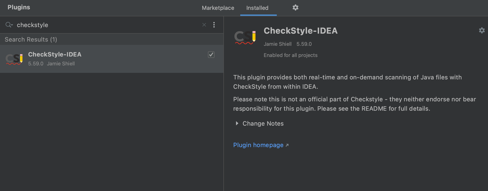
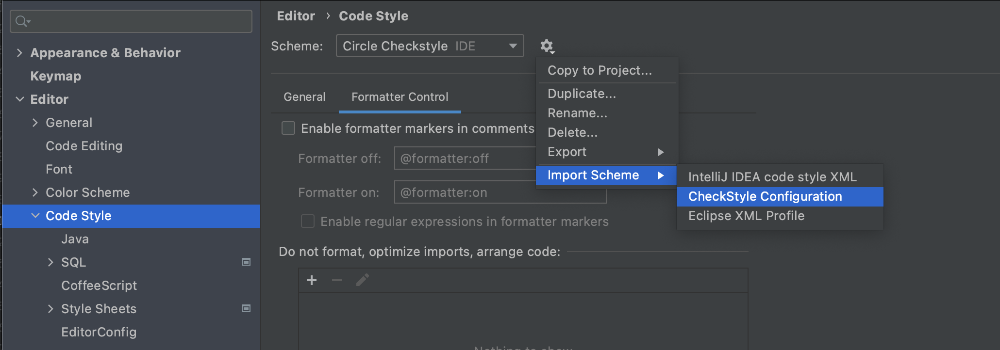
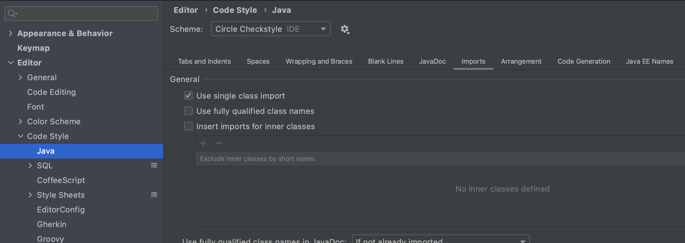
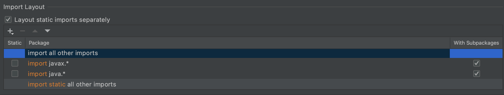

# actions-checkstyle

Runs checkstyle using reviewdog on pull requests.

This configuration is based on https://github.com/nikitasavinov/checkstyle-action, the only difference is that we package our own checkstyle.xml so that it's centrally defined and can be used in all of our repositories.

## IntelliJ Integration
If you use IntelliJ for development, it is very helpful to setup IntelliJ so that its Reformat Code capabilities produce Checkstyle-compliant code. 

To do this, first install the CheckStyle-IDEA plugin.

Then import `checktyle-circle.xml` as a **CheckStyle Configuration** under **Editor -> Code Style**:

You will also need to ensure your **Import Layout** is correct, which is in the **Imports** tab under **Editor -> Code Style -> Java**

At the bottom of this screen, ensure your **Import Layout** looks like this:
